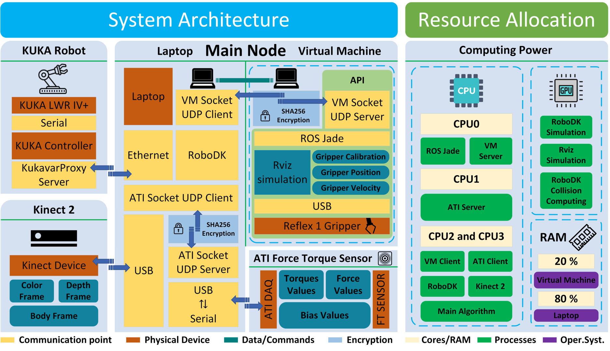
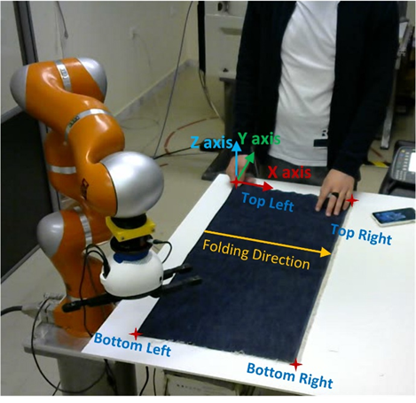
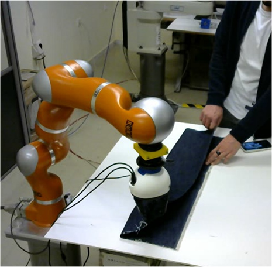
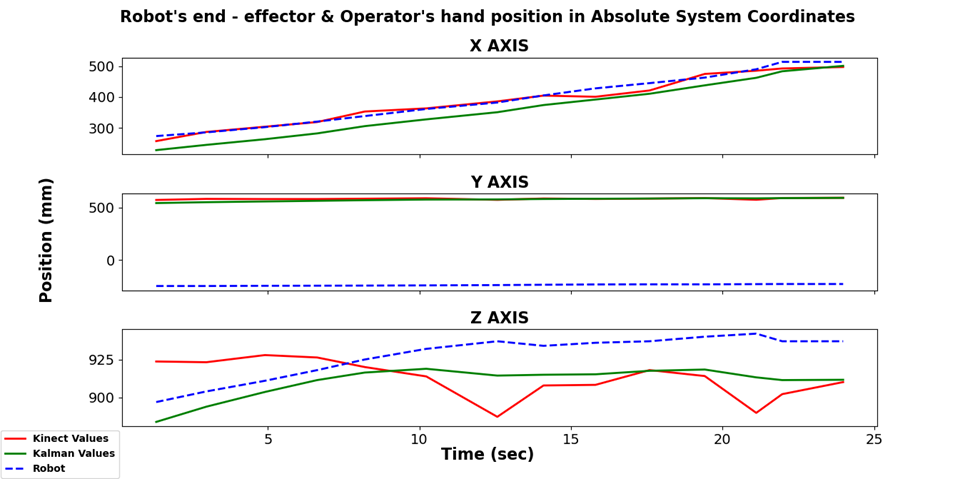
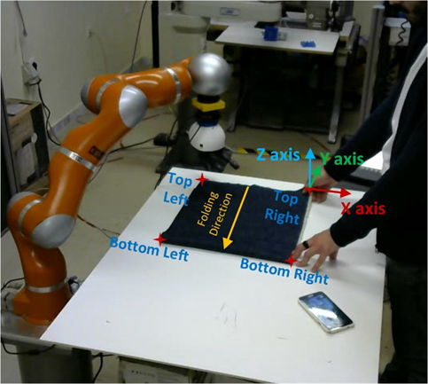
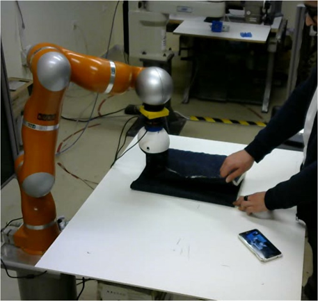
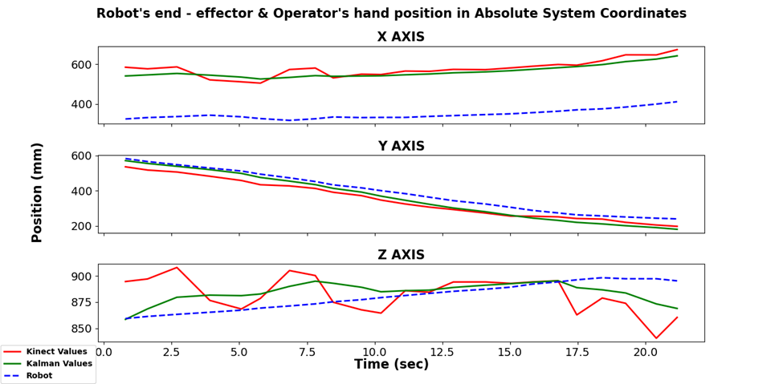

# KinectPython
(https://github.com/KonstantinosAng/KinectPython/issues)

## Table of Contents
1. [Description](#Description)
2. [Installation](#Installation)
    - [Kinect Setup](#Kinect)
    - [Python Setup](#Python)
    - [RoboDK Setup](#RoboDK)
    - [Reflex One Setup](#ReflexOne)
    - [ATI Gamma FT Setup](#AtiFT)
3. [Usage](#Usage)
4. [Examples](#Examples)

***
## Description

This algorithm is designed to utilize the [Kinect for windows 2 RGB/D sensor](https://developer.microsoft.com/el-gr/windows/kinect/), 
the [KUKA LWR IV+](https://www.kuka.com/en-de/products/robot-systems/industrial-robots) industrial robot, 
the [ATI Force Torque Gamma Sensor](https://www.ati-ia.com/products/ft/ft_models.aspx?id=Gamma), 
the [Reflex One](https://www.labs.righthandrobotics.com/reflexhand) gripper 
and non Linear [Kalman Filter](http://web.mit.edu/kirtley/kirtley/binlustuff/literature/control/Kalman%20filter.pdf) estimation to enable the 
Human - Robot Collaboration for fabric folding. This algorithm is an extension of this [publication](https://www.researchgate.net/publication/278028040_Human_Robot_Collaboration_for_Folding_Fabrics_Based_on_ForceRGB-D_Feedback).
The constructed framework and the hardware used can be seen in the figure below.
<p align="center">
     
</p>
<table>
  <tr>
    <td align="center" style="font-weight:bold"> CPU: Intel Core i3 - 3110m </td>
    <td align="center" style="font-weight:bold"> 2.4 GHz, 2 Cores & 4 Threads </td>
  </tr>
  <tr>
    <td align="center" style="font-weight:bold"> GPU: Nvidia Geforce GT710M </td>
    <td align="center" style="font-weight:bold"> GPU Memory 1 GB </td>
  </tr>
  <tr>
    <td align="center" style="font-weight:bold"> RAM: DDR3 1600 MHz </td>
    <td align="center" style="font-weight:bold"> 8 GB </td>
  </tr>
</table>

## Installation

### Kinect Setup <a name="Kinect"></a>

To install the drivers for the Kinect 2 for windows download and install the [Kinect for Windows SDK 2.0.](https://www.microsoft.com/en-us/download/details.aspx?id=44561)

### Python Environment Installation <a name="Python"></a>

The constructed architecture works only on Windows and is tested with Python 3.6. 
First create a fresh conda virtual environment with anaconda that uses Python 3.6 with
the following steps:

1. Download and Install Anaconda for Windows [using this link](https://www.anaconda.com/products/individual#windows).

2. Create a new virtual env with Python 3.6. Open the Anaconda Prompt and type the following command.

    ```
    conda create -n name_of_your_environment python=3.6
    ```

3. Activate the constructed environment.
    ```
    conda activate name_of_your_environment
    ```
4. Install all **requirements** from requirements.txt using the following command.
    ```
    pip install -r requirements.txt
    ```
5. Download all files using git clone or the .zip option and place them all in a 
folder wherever you want.

6. Open the Anaconda Prompt and type the following commands to find the directory
of the installed python in the conda environment.
    ```
    conda activate name_of_your_environment
    
    where python
    ```
7. Navigate to the Python's displayed directory, for example
   ```
   C:\Users\UserName\.conda\envs\name_of_your_environment
   ```
8. Navigate inside the pykinect2 installed Library of the Python.
    ```
    C:\Users\UserName\.conda\envs\name_of_your_environment\Lib\site-packages\pykinect2
    ```
9. Replace all the files inside the pykinect2 installed Library with the files located in the
pykinect2_original folder inside the repository's downloaded files.

10. Add Python Directory to the systems Environment Variables PATH.
    - Search for _Edit the system environment variables_.
    - From the Advanced Tab click on the environment variables.
    - From the System variables scroll down, select Path and click on Edit.
    - By clicking on New add the following paths.
        ```
        C:\Users\UserName\.conda\envs\name_of_your_environment
        C:\Users\UserName\.conda\envs\name_of_your_environment\python.exe
        C:\Users\UserName\.conda\envs\name_of_your_environment\Library\bin
        C:\Users\UserName\.conda\envs\name_of_your_environment\Scripts
        ```
 
### RoboDK Installation <a name="RoboDK"></a>

1. To configure RoboDK download and install the latest version of RoboDK [using this link.](https://robodk.com/download)

2. After downloading and installing the RoboDK, load all the 3D models from the Models/ folder and place them in the correct position.

3. The file _RoboDK/KUKA/KUKA.rdk_ has the constructed workspace of our laboratory workspace, including the Kinect, the robot and the table and can be loaded in RoboDK.

4. After constructing the collaborative space, a connection to the Real KUKA Robot must be established using the Instructions on the [_RoboDK/KUKA_2_ROBODK_COMMUNICATION/Instructions.txt_](RoboDK/KUKA_2_ROBODK_COMMUNICATION/Instructions.txt) file.

5. After loading the files and connecting to the robot, leave the RoboDK open and connected.

### Reflex One Gripper Installation <a name="ReflexOne"></a>

The Refex One  Gripper works only with ROS Jade on Ubuntu 14.04 LTS. In order to install and configure the Reflex One software follow the instructions on the [_Gripper/instructions.txt_](Gripper/instructions.txt) file.

### ATI Gamma FT Sensor Installation <a name="AtiFT"></a>

The ATI FT Gamma Sensor works with Linux and Windows and Python 2 or 3. To setup the ATI FT Sensor follow the instructions on the [_ATI_FT/instructions.txt_](ATI_FT/instructions.txt) file.

## Usage

If the installation is completed and everything works, then follow the next steps to use the code.

1. Start the KUKA Controller, select the RoboDKsync35.src file, run it in an automatic loop from the teach pendant and lower the robot speed for safety.

2. Open RoboDK, load the workstation file, connect to the robot and leave it open.

3. Connect the Gripper and start the ROS API by running the ros_server.sh bash file.

4. Power On the ATI controller, connect the ATI FT sensor via USB and run the [_ATI_FT/ati_ft_sensor.py_](ATI_FT/ati_ft_sensor.py) file.

5. Run the [_test view.py_](test_view.py) file to adjust the Kinect's view and position.

6. Capture the background by running the [_background_photo.py_](backround_photo.py) file.

7. Then lay down the fabric and make sure it is unfolded properly.

8. Connect the Kinect via USB to the computer.

9. Open the [_track_v3.py_](track_v3.py) file and change the following flags according to what you want to use:
    - dim = True  # Flag for finding the fabric's dimensions
    - cal = False  # Flag for calibrating the camera
    - Sim = True  # Flag for starting RoboDK
    - RealMovement = True  # Flag to move the real robot with RoboDK
    - gestureInit = True  # Flag for custom Gesture classifier
    - gripperInit = True  # Flag to connect to gripper
    - sensorInit = True  # Flag to connect to the ATI FT Sensor
    - kalmanInit = True  # Flag for drawing kalman on screen
    - skeletonInit = True  # Flag for drawing kinect's skeleton tracking on screen
    - cloudInit = False  # Flag for Cloud Skeleton Visualize in RoboDK
    - cloudPointInit = False  # Flag to import the workspace as a pointCloud in RoboDK
    - full_screen = False  # flag to open pygame in fullscreen

10. Save and run the [_track_v3.py_](track_v3.py) file.

11. if everything is correct you will see the following lines on the screen:
    ```
    +-----------------------------+
    [MAIN] Elapsed Time:  seconds
    [MAIN] Loaded: 100%
    [MAIN] Starting...
    +-----------------------------+
    [ATI FT CLIENT]: Message from Server: Hello UDP Client
    [ATI FT CLIENT]: Message from Server: Hello UDP Client
    [ATI FT CLIENT]: Message from Server: Started ATI FT... You can grab...
    +-------------------+
    Connecting to Gripper Server
    [GRIPPER CLIENT]: Message from Server: Hello UDP Client
    [GRIPPER CLIENT]: Message from Server: Hello UDP Client
    [GRIPPER CLIENT]: Message from Server: Started ROS... You can publish...
    [GRIPPER CLIENT]: Message from Server: Hello UDP Client
    [GRIPPER CLIENT]: Message from Server: Opened Gripper
    [ROBODK]: Connection Successful
    [ROBODK]: Robot Status: Connected
    +-------------------+
       Fabric Detected   
       Width (mm): 
       Height (mm): 
    World Center Point (XYZ in mm):
     Color2World Fabric Points (mm):
     ISO Speed Calculated
    +-------------------+
    +-------------------+
      Starting Tracking  
    +-------------------+
    ```
    
## Examples
The framework was tested by performing two folds in two different directions. Image examples from the first fold:
<table>
  <tr>
    <td align="center" style="font-weight:bold"> Fold 1: Start </td>
    <td align="center" style="font-weight:bold"> Fold 1: End </td>
  </tr>
  <tr>
    <td></td>
    <td></td>
  </tr>
</table>
<p align="center">
     
</p>
Image examples from the second fold:
<table>
  <tr>
    <td align="center" style="font-weight:bold"> Fold 2: Start </td>
    <td align="center" style="font-weight:bold"> Fold 2: End </td>
  </tr>
  <tr>
    <td></td>
    <td></td>
  </tr>
</table>
<p align="center">
     
</p>
